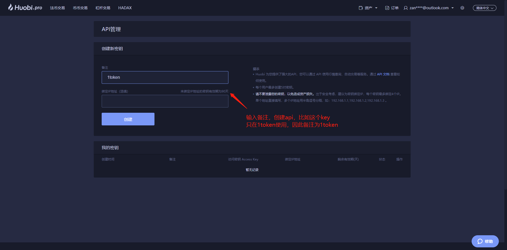
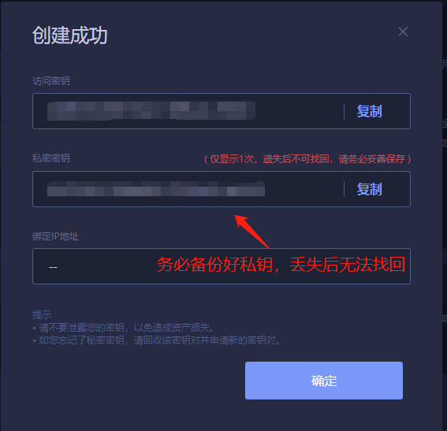
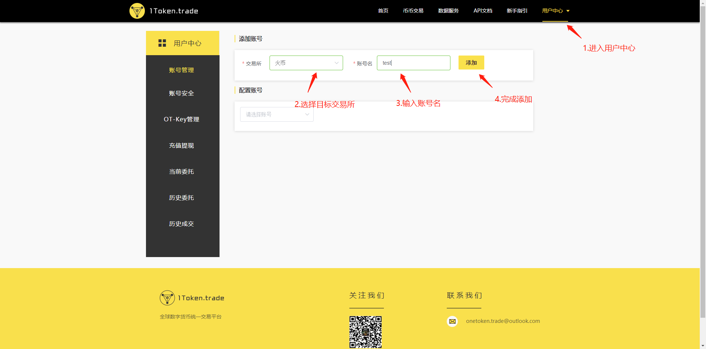
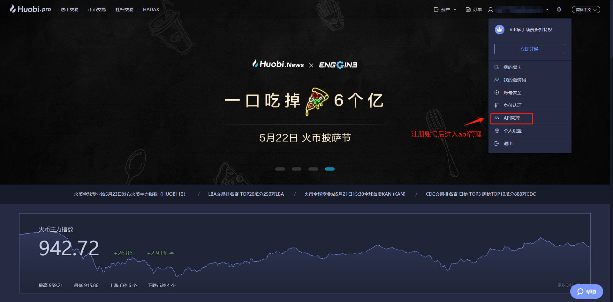
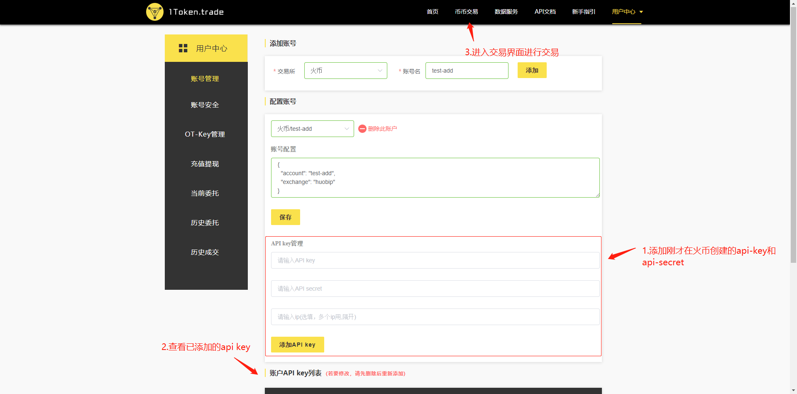

# 通过1Token网页来进行交易

### 第一步 点击注册

### 第二步 填写信息 完成注册

### 第三步 登录交易所，点击API管理 （以火币为例）

### 第四步 设置API备注，创建API

### 第五步 保存访问密匙和私密密匙

### 第六步 进入用户中心，选择交易所并设置账号名。

### 第七步 输入密匙与私匙，添加API，进入币币交易界面。

### 第八步 进入币币交易界面进行交易

