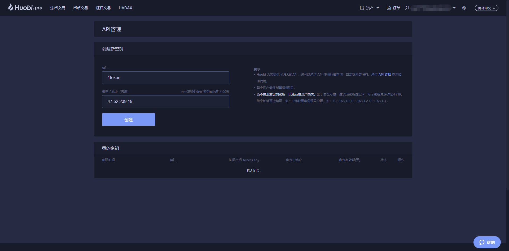
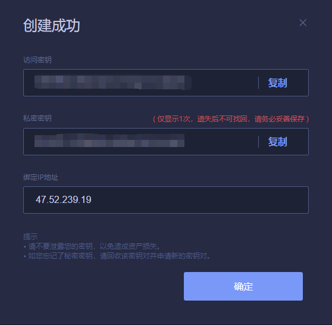
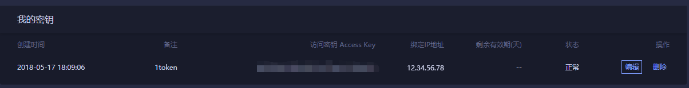
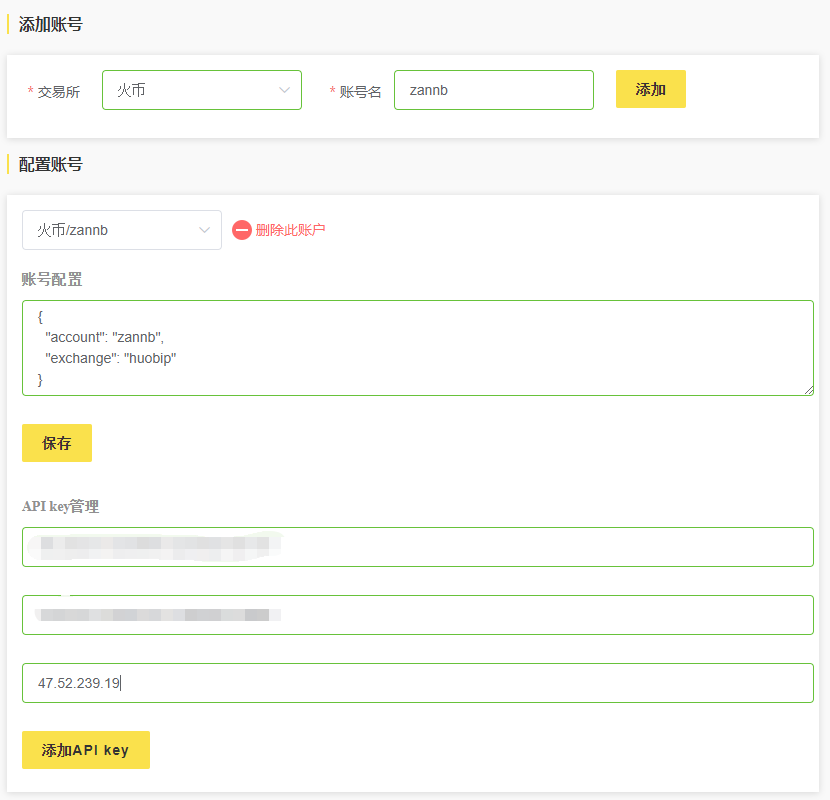
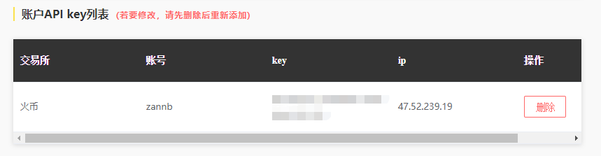

# 添加IP白名单

### 给key和secret加保险

推荐在其他交易所生成api-key与api-secret时，将下方所列经认证为1token所持有的ip地址加入该key-secret的白名单，以确保只有1token可以使用该key-secret进行交易。这样，就算key与secret不慎被盗，别人也无法通过白名单之外的设备进行交易，从而更高地保护您的个人财产。

以火币Huobi为例

1.在生成`key`, `secret`时填入1token持有的ip中的一个或多个。如下图中将生成一对专供在1token交易使用的`key`, `secret`，我们将他命名为__1token__，并将[1token持有的ip](https://1token.trade/api/v1/basic/ip-pool)中的一个或几个填入图中的指定ip地址。这里我们只将ip列表中的`47.52.239.19`这个ip填入白名单。

2.生成并确认

3.在1token官网的账户管理中添加该账户，并将`key`, `secret`以及`白名单IP`填入。此处的白名单ip与第一步中在huobi填入的ip应该一致，否则1token将无法得知应当使用哪台机器来完成本对`key-secret`相关操作。

4.之后可在账户的api列表中查看刚添加的一项。可以看到，在ip一项里有第一步中填入的ip`47.52.239.19`，至此，白名单的添加就完成了。

这样子就只有通过`47.52.239.19`这个ip发出的交易请求才会被huobi接受，大大增加了个人账户的安全性。

后续的使用请参考[通过1token网页进行交易](..\getting-started\website-user.md)或是[通过1token API进行交易](..\getting-started\api-user.md)。

### 1token持有的ip

请参考ip列表 [https://1token.trade/api/v1/basic/ip-pool](https://1token.trade/api/v1/basic/ip-pool)
